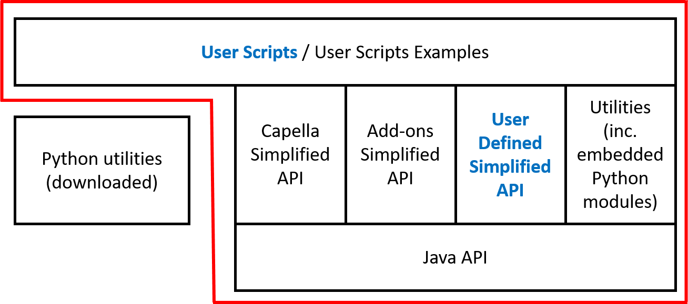

# Python for Capella

*Python for Capella* allows you to interact with your Capella model using Python. You will be able to create Python scripts to read and write from/to your Capella model.

# Introduction to the need

One basic need of most Capella users is to be able to extract information from Capella models.

In addition to that, the need to be able to import information in a Capella model is also important (to initialize a model, update it...).

However, those needs are currently poorly supported by the tool and existing add-ons.

The idea of this initiative is to provide Python API so that users will be able to develop scripts for Capella.

Scripts will be able to support export / import of data in excel in a generic way, but also at the end could support many more use cases.

# *Python for Capella* solution

The proposed solution is an add-on for Capella allowing to develop and execute scripts in Capella.

(Technically, it encapsulates Eclipse EASE to allow execution of scripts, PyDev for the edition of Python Scripts, and a Python interpreter.)

Here is a preview of the solution:

The solution is based on a 3 levels architecture:

Level | Content | Defined | Used By
----- | ------- | ------- | -------
1     | Java API to bridge Python with Java. It is defined in the most generic way to support extraction / import of any kind of information   **Provided by default with the add-on** | Java developers | Advanced Users to develop technical Python Libraries
2     | Python technical libraries. Provides to basic users a set of simplified operations to be used to define high level scripts  **Some libraries are provided by default, including a simplified definition of Capella metamodel and libraries for most common add-ons (Requirements, PVMT)** | Advanced Capella Users  (if default libraries need to be extended) | Basic Users to build high level scripts | Basic Users to build high level scripts
3     | High-level user scripts. Used to define the actions to perform (information to be exported / imported)  **Some examples are provided by default to illustrate the capabilities of the add-on** | Basic Users | Basic Users to execute the scripts

Legend:

- Circled in red: the scope of the solution
- Blue: what is created by users

More in details, the solution supports:

- **the use of a common scripting language**, not dedicated to Capella: **Python**
- **easy to share**: scripts are defined in the workspace, can be exported in a zip file and imported by another user
- **easy to use**: scripts can be executed from
  - contribution to contextual menu (right click on a model element)
  - right click on the script, execute (by default, IFE sample aird path is defined in sample scripts)
  - command line (for automatic extraction for example)
- **high customization capabilities** as all of the scripts are accessible by users to be modified / extended if necessary
- **extensibility of Capella metamodel by add-ons** (any information from the model can be accessed, even information from add-ons)
- **separation between technical stuff** (in level 2) **and high level scripting** (in level 3) to hide complexity to end users
- default libraries including:
  - a **simplified metamodel for Capella**, which can be extended if the simplified version does not covers specific needs
  - **libraries for common add-ons** (Requirement, PVMT)
  - **utilities** to support excel import / exports and possibly others
  - **examples** of high level scripts
- **wide compatibility with Capella versions** (the goal is to support at least Capella 1.3.x to Capella 5.x)
- **support of Capella and Team for Capella**

# Capella simplified metamodel of *Python for Capella*

*Python for Capella* relies on a simplified metamodel in order to ease the definition of scripts by end-users.

**What are the concepts of interest and their relations ? To which elements from which types can I access from a given element ?**

Data packages with classes (for instance 'LogicalArchitecture') and their relations are defined. 
Class Diagram Blanks can be displayed : [CDB] LogicalArchitecture to have information with concepts/classes related for example to the class 'Logical Architecture'.

This simplified metamodel is defined in a Capella model (**using Capella 5.0.0**).

Please have a look in the documentation tab of the model to know more about its content.

This model can be retrieved here:  https://github.com/labs4capella/python4capella/tree/master/specification/Capella%20Light%20Metamodel

Moreover, a documentation is generated from this model using M2Doc.
This documentation can be retrieved here:  https://github.com/labs4capella/python4capella/blob/master/specification/M2Doc%20generation/Python4Capella%20Simplified%20Metamodel.docx

PS: the Capella model can be retrieved by cloning the git repository, or by downloading a zip file of the last version of the repository.
For this last option, you need to go this the main page (https://github.com/labs4capella/python4capella) and select Code / Download ZIP

This conceptual metamodel is used to generate
- Python API code
- Metamodel documentation (including the implementation status)
- Some tests and document the test results

# Installation

You can install *Python for Capella* in your Capella thanks to an update site.
Then you will need to setup Python 3.7 in your environment for release before [2022-08-29](https://github.com/labs4capella/python4capella/releases/tag/2022-08-29). For realeases after [2022-08-29](https://github.com/labs4capella/python4capella/releases/tag/2022-08-29) you can install more recent versions of Python up to 3.11 see the [Python Installation](#python-installation) section.

1) You need to download the zip file from the available releases [here](https://github.com/labs4capella/python4capella/releases). You don’t need to decompress it
2) On the installation dialog, click the “Add…” button at the top to add an update site.
3) Select the “Archive…” button and select the zip file: ‘org.eclipse.python4capella.update.zip’.

4) Select Python4Capella feature.

   * If you are installing *Python for Capella* [2022-08-29](https://github.com/labs4capella/python4capella/releases/tag/2022-08-29) or above on Capella 1.4.x, you will need to install PyDev 8.2.0 instead of the version provided in the update site. You can get PyDev 8.2.0 by using this update site: https://www.pydev.org/update_sites/8.2.0.
4) Click the next button and complete the installation by clicking the finish button.

If you don't know how to install from an update site you can have a look at our [video](https://www.youtube.com/watch?v=qYTrO7THer0).

## Python Installation

You will need to setup Python 3.7 in your environment for release before [2022-08-29](https://github.com/labs4capella/python4capella/releases/tag/2022-08-29). *Python for Capella* support Python up to version 3.11 (see this [issue](https://github.com/labs4capella/python4capella/issues/216)).

If you are running Windows, you can download the following zip file and unzip it in your Capella installation directory, or any other location:

[https://github.com/labs4capella/python4capella/releases/download/2021-07-16/Python37.zip](https://github.com/labs4capella/python4capella/releases/download/2021-07-16/Python37.zip)

If you are running Linux or MacOS X, please check your distribution documentation to install Python 3.7 on your system. For realeases after [2022-08-29](https://github.com/labs4capella/python4capella/releases/tag/2022-08-29) you can install more recent versions of Python up to 3.11. In order to run provided sample scripts, you will also need to install [openpyxl](https://openpyxl.readthedocs.io/en/stable/). You can check the [Install new Python package](https://github.com/labs4capella/python4capella/blob/master/doc/org.eclipse.python4capella.doc/doc/developer/python/InstallNewPythonPackage.textile) page for more details or directly use your Python interpreter documentation.

# *Python for Capella* configuration

You need to import the *Python4Capella* project that contains the Python API needed to interact with Capella and store your own Python scripts.

Right click in the project explorer and select New > Other menu:

In the New dialog, select the *Python4Capella* project under the *Python4Capella* category:

You can click the next then finish buttons to complet the wizard.

At this point you will be prompted to configure your python environment, you can ignore the dialog for the moment and follow the next steps to setup your environment.

You now have the following *Python4Capella* project in your workspace:

Now you need to reference your Python interpreter:

Select the Window > Preferences menu

- select the PyDev / Interpreters / Python Interpreter
  - select the python executable from the [Python installation section](#python-installation) by clicking the New button

  

- select the Scripting / Python Scripting (using Py4J) (/!\ not Scripting PyDev)
  - select the python executable from the [Python installation section](#python-installation) by clicking the Browse button

  

- select the Scripting / Script Locations (needed to [contribute user interfaces](https://github.com/labs4capella/python4capella/blob/master/doc/org.eclipse.python4capella.doc/doc/user/general/TipsAndTricks.textile#contribute-to-capella-user-interface))
  - add /Python4Capella/sample_scripts by clicking the Add Workspace button

  

You can click the Apply and close button to finish your setup.

When you will open your fist Python file, you will be prompted by PyDev to define its default configuration:

You can validate the dialog by clicking the OK button.

Before you [run a Python script](https://github.com/labs4capella/python4capella/blob/master/doc/org.eclipse.python4capella.doc/doc/user/general/Run.textile), you will also need to [enable developer capabilities](https://github.com/labs4capella/python4capella/blob/master/doc/org.eclipse.python4capella.doc/doc/user/general/EnableDevelopmentCapabilities.textile).

# Documentation

You can refere to the plugin documentation for usage reference. The documentation is accessible by using the Help > Help contents menu from Capella, then on the right tree, you can select *Python4Capella*. To get started, you can have a look at the [writing script documentation](https://github.com/labs4capella/python4capella/blob/master/doc/org.eclipse.python4capella.doc/doc/user/general/Write.textile). You can also read the [run a Python script](https://github.com/labs4capella/python4capella/blob/master/doc/org.eclipse.python4capella.doc/doc/user/general/Run.textile) page to run one of the provided sample script.

You can also check the [tips and tricks](https://github.com/labs4capella/python4capella/blob/master/doc/org.eclipse.python4capella.doc/doc/user/general/TipsAndTricks.textile) page. 

# False errors in provided scripts

If you open provided scripts, you will notice some errors in them. Those errors can be ignored or even [removed](https://github.com/labs4capella/python4capella/blob/master/doc/org.eclipse.python4capella.doc/doc/user/general/RemoveFalseErrors.textile). They are related to the use of EASE that allows access to Java objects with the PyDev editor.

EASE is a scripting environment for Eclipse.
It allows to create, maintain and execute script code in the context of the running Eclipse instance. Therefore such scripts may manipulate and extend the IDE itself. 

The PyDev editor only recognize the Python language, and EASE add a custom way to import other scripts, declare methods and variables. At runtime EASE will be used and everything will work properly.

- some **import directives from EASE** are not recognized by PyDev

- some **methods** defined in EASE modules are not recognized by PyDev

- some other errors can happen when accessing **variables defined by EASE**

